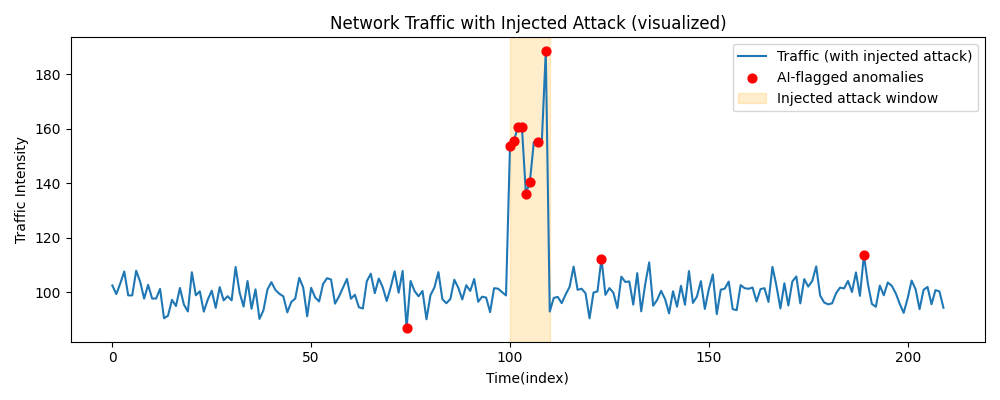

# AI in Cybersecurity: Detecting Anomalies like Stuxnet

This project demonstrates how **Artificial Intelligence (AI)** can detect unusual patterns in network activity, similar to how modern cybersecurity systems might spot threats like the **Stuxnet Worm** before they cause damage.

---

## Overview
The demo simulates network traffic using Python and applies an AI model called **Isolation Forest** to automatically detect suspicious behavior.

### Core Idea
AI learns what “normal” behavior looks like and flags activity that doesn’t fit the pattern, just like how anomaly detection systems help identify potential cyberattacks in real time.

---

## How It Works
1. **Normal Activity Simulation**  
   Generates typical network data centered around realistic traffic values.  
2. **Attack Injection**  
   Introduces a short burst of abnormal traffic to mimic a *Stuxnet-like anomaly.*  
3. **AI Detection (Isolation Forest)**  
   The model learns the normal pattern and automatically highlights anomalies.  
4. **Visualization**  
   A Matplotlib plot displays:
   - Blue line → Normal network activity  
   - Orange area → Simulated attack window  
   - Red dots → AI-flagged anomalies  

---

## Example Output

The chart below shows how the AI model detects the injected anomalies in the simulated network traffic:



---

## Tech Stack

| Component | Purpose |
|------------|----------|
| **Python 3.13** | Programming language |
| **NumPy** | Data simulation & numerical operations |
| **Matplotlib** | Data visualization |
| **Scikit-learn** | Machine learning model (Isolation Forest) |

---

## How to Run (Step-by-Step Guide)

### Requirements
- Install **Python 3.12+** (3.13 recommended)  
  Make sure to check “Add Python to PATH” during installation.
- (Optional) Install **Git** and **VS Code**.

---

### Step 1 — Clone the Repository
Open PowerShell or Command Prompt:
```powershell
mkdir C:\temp\test-clone
cd C:\temp\test-clone
git clone https://github.com/escanuelaedward/AI-Cybersecurity-Stuxnet.git
cd AI-Cybersecurity-Stuxnet
```

### Step 2 - Create and Activate a Virtual Environment
```powershell
python -m venv venv
.\venv\Scripts\Activate.ps1
```

### Step 3 — Install Dependencies
```powershell
python -m pip install --upgrade pip
pip install -r requirements.txt
```

## Step 4 - Run the Demo
```powershell
python demo/demo_network_anomaly.py
```
### Close out
```powershell
Deactivate
```
